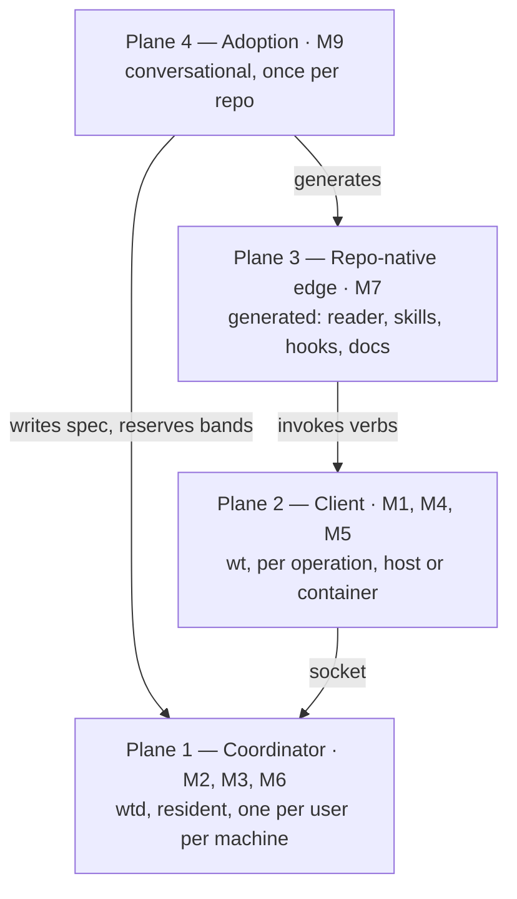

# Worktree Manager — Target System Architecture

**Status:** architecture of record, revision 2. Describes the system to be built. Nothing is implemented yet.
**Date:** 2026-08-11
**Inputs:** [`worktree-tooling-requirements.md`](../worktree-tooling-requirements.md), gathered from three shipped implementations, and [`docs/design/`](design/), nine module designs covering M1 to M9 plus a [measured filesystem experiment](design/experiments/virtiofs-guarantees.md).

## Revision 2 changes the coordination model

Revision 1 had every `wt` invocation write a shared state directory directly, coordinating through a lock file and a generation counter. A container reached that directory through a bind mount. This revision puts a coordinator process on the host and makes `wt` a client of it.

The module documents predate the change and are superseded on specific points: `00-overview` §6, `01-identity` §5, `02-coordination` §8, §9 and §12, `03-drivers` §2.3, `06-fleet` §6, and `08-platform` §5. On every other mechanism the module documents remain correct, and [`03-drivers.md`](design/03-drivers.md) remains authoritative for the spec schema.

## 1. Scope

This document describes the target system as one structure: its components, the boundaries between them, the state it owns, the flows that cross it, and the decisions that fix its shape. A reader who has seen neither the requirements nor the module designs should finish it able to argue with the design.

Three parts here have no equivalent in the module designs: the plane model in §5, the authority rules in §8.6, and the risk register in §14. The register gathers the open questions spread across nine files and keeps the ones that could still change the structure.

## 2. The problem

Git isolates the files in a worktree. Every other resource an application touches stays shared. The second worktree to start either fails to bind a port or attaches to the first worktree's state and reports nothing.

Four collisions from the three source implementations:

- A compose file that pins `name:` makes the second worktree adopt the first worktree's containers. Nothing fails.
- Two desktop processes race on the `ui_leader` lease in a shared SQLite file. The dispatch matcher, the idle pinger and the prune loop then run in two places at once.
- Concurrent VMs carve bridge subnets from one address pool. Past roughly four instances, network creation fails with `all predefined address pools have been fully subnetted`, and the failure surfaces as a stalled dataplane sync.
- A production stack runs on the same development machine on fixed ports and must never be touched.

Per-invocation flags such as `--db`, `--port` and `COMPOSE_PROJECT_NAME=` solve all of this in principle. Developers do not thread them through every entry point, so worktrees keep colliding. Parallel agent sessions raise the cost: an agent cannot be relied on to remember which port, database or branch it owns, so the environment has to describe itself and enforce its own boundaries.

### 2.1 Who touches the system

| Actor | Uses |
|---|---|
| Developer | Runs `wt` directly; runs the onboarding skill once per repo |
| Claude Code and the dispatch harness | Create worktrees, then call the generated create and remove skills |
| Agent session inside a worktree | Reads the briefing block; hits the enforcement hook on every file write |
| Agent container | Runs `wt` against the host coordinator over a mounted socket |
| The repo's own application | Reads the descriptor file at startup. It contacts no coordinator, links against nothing, and requires nothing installed. |

### 2.2 Out of scope

Inherited from the requirements: no Docker-in-Docker, no isolating content-addressed caches such as the Go module cache or the pnpm store, no serialising instead of isolating, no auto-creating an environment on first mutation, no named-profile indirection.

Added by this design: the system learns no repo's domain, it does not create worktrees, and it does not translate paths between filesystem namespaces.

## 3. Architectural drivers

| Force | What produces it | Structural consequence |
|---|---|---|
| An operation must never appear to succeed when it did nothing | A pinned compose project name attaches silently. A client with no coordinator would allocate into a private registry and exit 0. | One coordinator holds all shared state. A client that cannot reach it fails loudly and has no local fallback. |
| Coordination across worktrees and across repos is the whole job | A linked worktree cannot see a sibling's files. Three per-repo registries could not see each other. | The coordinator owns the registry, the port band ledger and every allocation decision on the machine. |
| An agent container must coordinate with the host | An agent clones the repo into a container and runs compose against the host's daemon. | The client speaks to the coordinator over a socket. Host-namespace work happens in the coordinator. |
| An agent container should not hold the docker socket | Mounting the host docker socket into a container grants that container root on the host. | The coordinator holds the socket and performs teardown on the client's behalf, restricted to what the client owns. |
| Isolation must be an explicit act | Auto-creating an environment on first mutation fragments state when the developer wanted a quick branch. | No auto-allocation anywhere. A session-start hook detects an un-allocated worktree and names the command. |
| A repo that has not adopted the tooling behaves exactly as before | Requirement A3 | The committed spec is the adoption signal. An absent descriptor means nothing on its own. |
| Agents cannot hold environment state in their heads | Prompt-level worktree confinement takes a cwd snapshot once and then stops holding. | The descriptor describes itself. Enforcement runs as a tool-call hook, locally, with no coordinator round trip. |
| Three repos made different policy calls and each was correct for its context | Requirements Part C | Policy is spec configuration. Neither binary branches on repo identity. |
| The tool runs before the repo's package manager does | A CLI running through `tsx` cannot start until `pnpm install` has run. | The client is an external static binary. |
| Path containment carries a security property | The enforcement hook decides whether an agent's write lands inside its worktree. | Every OS-dependent and filesystem-dependent behaviour is isolated in one enumerated module. |

## 4. Decisions

### 4.1 A host coordinator owns all shared state

`wtd` runs as a per-user background process on the machine. It owns the registry, the port band ledger, slot allocation, exclusions, fleet health and every operation that needs a host namespace. Clients contact it over a socket.

**The alternative this replaces.** Revision 1 had every `wt` invocation write a shared state directory directly, with an exclusive-create lock and a generation counter making concurrent writers safe. A container bind-mounted the host's directory and set `WT_HOME` to it. Three problems ended that arrangement.

- A container that mounted nothing fell back to `$HOME/.wt` on its own filesystem, created a private registry, allocated slot 1, and exited 0 while the host already held slot 1. An empty registry is indistinguishable from a machine with no worktrees, and the port probe that would have caught the collision is the operation already reporting unavailable inside a container.
- Compose teardown from a container required the host docker socket to be mounted, which grants that container root on the host.
- The port probe, process discovery and VM lifecycle all needed host namespaces that a container does not have, so three of the four operations degraded to reporting unavailable.

A coordinator resolves all three. Connection refused is diagnosable. The socket stays on the host. Probing, reaping and VM work happen in the process that has the namespaces for them.

**What it costs.** A resident process has a lifecycle the previous design did not: start, restart, survive reboot, upgrade, discovery, logging and diagnosis. The client and the coordinator can hold different versions, so the protocol needs negotiation. Authorisation becomes a real question, since filesystem permissions previously made it impossible for a container to touch a host entry and §4.3 has to replace that barrier. Mounting is not eliminated. A container mounts a socket instead of a state directory, and the gain is the failure mode.

**Hosting.** Per-user in every case. Docker Desktop, Colima profiles, WSL2 distros and the state directory all belong to the logged-in user, and a root-owned process would have to reach back into the user's session for each of them.

| Platform | Host | Transport | Start |
|---|---|---|---|
| macOS | launchd LaunchAgent in `~/Library/LaunchAgents` | HTTP on loopback | `RunAtLoad` and `KeepAlive` |
| Linux | systemd user unit | HTTP on loopback | a paired `.socket` unit with a TCP `ListenStream`, handed over through `LISTEN_FDS` |
| Windows | service under the user account, or a logon scheduled task | HTTP on loopback | automatic start |

Windows carries the awkward case. A conventional service runs in session 0, isolated from the user's desktop session, where it cannot reach Docker Desktop's user-context pipe or a per-user WSL2 distro. A service configured to run as the user account works. A logon scheduled task is the more common idiom and gives up the service control manager's restart handling. Linux has a smaller version of the same problem: a systemd user unit stops at logout unless lingering is enabled for the account.

The transport is HTTP on `127.0.0.1:7833` by default, on every platform. Unix sockets, the Windows named pipe and peer credentials are gone. Binding off loopback requires `--allow-remote`; the coordinator performs privileged operations on its clients' behalf, and a LAN-reachable coordinator hands that reach to the network.

The cost of the change is stated rather than glossed. Peer credentials gave host identity from the kernel — `SO_PEERCRED` on Linux, `LOCAL_PEERCRED` on macOS, the pipe's owner-only ACL on Windows — and a client could not claim to be the host user without being it. Over TCP there is no equivalent, so host identity is now "can read a 0600 file in your own home": at startup the coordinator writes `endpoint.json` carrying its base URL and a generated token, and possession of that token is the proof. Any process running as the user can read it, whereas peer credentials also proved it at connect time. Same-user processes could already impersonate each other by other means, so the practical loss is small — but it is a loss, and HTTP over a unix socket would have avoided it.

### 4.2 A thin client binary, written in Go

`wt` is a single static executable on `PATH`, built with `CGO_ENABLED=0` and cross-compiled to macOS, Linux and Windows. It classifies the working tree, calls the coordinator, writes the descriptor, runs the repo's hooks and formats output.

A library that each repo imports was rejected. The source repos are Go, Go and TypeScript, so the library gets written three times and drifts three ways.

The client stays a static binary for one specific requirement. It must run before `pnpm install`, which nothing running through `tsx` can do.

The coordinator is the same Go codebase, shipped as a second entry point, so the driver implementations and the spec parser exist once.

### 4.3 A client mutates only the entries it created

The coordinator records the client identity that created each entry and refuses destructive verbs from any other client. Reads are unrestricted, apart from seed credentials, which are redacted for every client except the owner.

Host clients present the token from the 0600 `endpoint.json`, and their identity is the constant `host`. Container clients cannot read that file — they are never given the store — so they present a separate token the operator configures with `wtd --container-token`. Absent that flag the coordinator admits host clients only, so containers are opt-in exactly as the loopback TCP surface used to be.

A disposable container presents a new container id and a new hostname on every run, so identity derived from the connection would mean nothing it created could ever be removed.

Such a client declares itself ephemeral at connection time. The coordinator marks its entries reclaimable and garbage-collects them once that client has been absent for a configured interval. Teardown works from a handle held in the registry, and the coordinator has host privileges, so reclamation is safe without the client ever returning.

### 4.4 The coordinator is required, and there is no local fallback

`wt show` reads the descriptor from the working tree and keeps working when the coordinator is down. Every other verb fails with an error naming the coordinator and the command that starts it.

A fallback that wrote the state directory directly was rejected. It would re-introduce multi-writer locking, and it would produce exactly the divergence between two sources of truth that §4.1 exists to remove.

### 4.5 The system does not create worktrees

There is no `create` verb. `init` attaches to a tree that Claude Code's `isolation: "worktree"`, the dispatch harness, a container's `git clone`, or a developer's `git worktree add` already made.

A `create` verb would contribute only the pre-flight: repo root, default branch, clean tree, `git pull --ff-only`. It would duplicate what the creating tool already does, in a second place, with a second set of conventions about branch naming and base branches.

Three consequences run through the rest of the design.

- `init` never refuses over working-tree state. A worktree an agent has been editing for an hour is dirty by design.
- The required ordering of create, `init`, start is only half enforceable. The system can detect whether the first step happened and cannot own it.
- Orphaned registry entries are routine. The tool that created a worktree also removes it, and it will not call `wt rm` first. Fleet reconciliation carries that load.

### 4.6 Adoption runs as a Claude skill

Onboarding a repository covers auditing its resources, choosing port bands, making the policy calls, writing the spec, generating artefacts, patching entry points, and proving the result with two live worktrees. That work runs as a skill. Neither binary performs inference.

A scanner can draft the part that is visible in the repository: compose files, committed default ports, the package manager, `$HOME` paths in source, what is currently listening. The part that decides whether the result is correct comes from the developer: blast radius, leases and leader election, a co-resident production stack, external namespaces such as a third-party API tenant or a piece of hardware, and whether the shared state is something the worktree's user wants to reach.

The coordinator exposes facts as machine-readable primitives and refuses specs it cannot honour. A repo that never uses Claude can be adopted by hand-writing a spec, because the spec is the only artefact the system consumes.

## 5. Four planes

The system is four planes with different execution models, lifetimes, privileges and failure modes.



| | Plane 1 | Plane 2 | Plane 3 | Plane 4 |
|---|---|---|---|---|
| Artefact | `wtd` | `wt` | generated files | a skill |
| Lifetime | resident | per operation | per session or call | once per repo |
| Runs on | the host, as the user | host or container | wherever the agent runs | a developer's session |
| Privilege | docker socket, host namespaces, the state directory | the worktree | the worktree | the repo |
| Inference | none | none | none | all of it |

Two properties are easy to lose and worth stating directly.

Plane 3 has no dependency on planes 1 and 2. The generated descriptor reader parses the descriptor file and reads nothing else: no registry, no socket, no requirement that either binary be installed. An application can be built and shipped without the tooling present, and it starts normally when the coordinator is down.

Plane 3 is generated per repo rather than shipped generic. The three existing skill pairs work because they name the repo's own commands, its ports and its shared resources. A generic pair that read the descriptor at runtime would be thinner, because much of a skill's value is in what it states before anything runs.

## 6. Components

The nine modules split across the socket. Six run in one process, three in the other, and one is divided.

```mermaid
graph LR
    subgraph COORD["Coordinator · wtd — host, resident, privileged"]
        M6["M6 Fleet health<br/>list, doctor, reconcile, cleanup"]
        M3["M3 Resource drivers<br/>derive, probe, apply, teardown"]
        M2["M2 Coordination core<br/>registry, slots, bands, authorisation"]
        M8a["M8a Host platform<br/>listener discovery, signalling,<br/>docker socket, VM driver"]
    end
    subgraph CLIENT["Client · wt — host or container, per operation"]
        M4["M4 Lifecycle<br/>verbs, ordering, hooks, output"]
        M5["M5 Delivery<br/>descriptor, .env, resolution"]
        M1["M1 Identity<br/>classification, slug, containment, guard"]
        M8b["M8b Local platform<br/>path realisation, case sensitivity,<br/>shell resolution"]
    end
    CLIENT -->|HTTP on loopback| COORD
```



| Module | Runs | Constraint that shapes it |
|---|---|---|
| M1 Identity | client | Pure. It reads git and the environment and returns values. It writes nothing and calls no coordinator. Every dangerous mistake this module could prevent was a misreading of git semantics, so the code must be testable against real repositories with nothing else in the way. |
| M2 Coordination | coordinator | The only writer of shared state, and now the only process that can reach it. Owns the identity model and the authorisation check on every mutating call. |
| M3 Drivers | coordinator | Holds no knowledge of any application. It understands infrastructure such as compose labels, because teardown by label requires it. Every operation runs in host namespaces. |
| M4 Lifecycle | client | The only module that runs the repo's own code. Hooks need the worktree, its cwd and its emitted environment, so they run where the tree is. |
| M5 Delivery | client | Writes the descriptor into the worktree, which the coordinator may not be able to see. |
| M6 Fleet | coordinator | The only module that operates across repositories. Destructive verbs are filtered by the caller's ownership. |
| M7 Agent surface | generated | Templates with the repo's facts substituted. The enforcement hook calls `wt guard`, which is local and never touches the socket. |
| M8 Platform | both | A caller never writes `if darwin`. The enumeration of platform surfaces is the deliverable; a surface missing from that list is a surface nobody checked. |

### 6.1 Command surface

| Command | Coordinator | Purpose |
|---|---|---|
| `init` | yes | Attach to the current tree: allocate, materialise, emit. Idempotent. |
| `start` | no | Run the hooks that bring the stack up. |
| `show` | no | Read the descriptor back. Works with the coordinator down. |
| `guard` | no | Classification and containment for the enforcement hook. |
| `rm` | yes | Safety checks locally, then reap, teardown and deallocate in the coordinator. |
| `list`, `doctor`, `reconcile`, `cleanup` | yes | Fleet operations across every repo on the machine. |
| `clients` | yes | Known clients, last seen, entries owned. |
| `spec validate`, `spec explain`, `bands list/suggest/reserve`, `ports scan` | yes | The primitives the onboarding skill reads. |
| `daemon status`, `daemon install` | — | Register, start and diagnose the coordinator. |

Two verbs stay local on purpose. `show` is what every generated doc, skill and briefing points at, and pointing them at something that can be down would be a poor trade. `guard` runs on every agent tool call, so a round trip would put the coordinator in the latency path of an editing session.

## 7. Extension model

Everything the system does to a repository falls into one of three categories. This seam keeps repo-specific behaviour out of both binaries.

### 7.1 Drivers

Five allocatable resource types cover eighteen traits in the requirements, which is the strongest evidence that the slot abstraction is the right one. All five run in the coordinator.

| Driver | Covers | Derived value |
|---|---|---|
| `port` | host port binding, including fixed-relationship groups | an integer from the band ledger |
| `namespace` | compose projects, and test stacks by instantiating it twice | a derived name |
| `cidr` | subnet allocation | a slice of a pool, by slot |
| `state-path` | `$HOME` databases, registries, credentials | a path |
| `machine` | a per-worktree VM or daemon | a Colima profile or a WSL2 distro |

Each driver implements six operations. `derive`, `probe`, `verify` and `blastRadius` are required. `apply` and `teardown` are optional, independently of each other.

| | No teardown | Has teardown |
|---|---|---|
| **No apply** | `port`, `cidr`. A number written into a descriptor. The application materialises it when it binds or routes. | `namespace`. The application's compose run creates the containers. The coordinator destroys them. |
| **Has apply** | — | `state-path`, `machine` |

The top-right cell explains teardown by label. The coordinator never creates a container, so it holds no handle from creation and has to find the containers again by asking the daemon for everything carrying `com.docker.compose.project=<name>`. That generalises to a rule for every driver: a driver that never creates a resource discovers it instead.

A handle always comes from the registry. Developers run `git worktree remove` by hand first, so a teardown that needed a compose file, a descriptor or a lockfile from inside the tree would strand the resources permanently. The coordinator often cannot see the tree at all, which makes the same rule a hard requirement rather than a precaution.

A co-resident production stack is not a driver. It is an exclusion list the coordinator applies during allocation, and again when validating a descriptor it did not write.

### 7.2 Hooks

Repo-declared commands the client sequences without understanding: dependency install, image pre-pull, build, seed, health-wait. The client owns ordering, rollback, dry-run and output discipline. The repo owns the command string.

The contract: cwd is the worktree root, the environment is what the client emitted, output streams to stderr, a non-zero exit stops the sequence, and `--dry-run` prints the resolved command without running it.

Hooks never run in the coordinator. They need the worktree, and running arbitrary repo commands in the one privileged process on the machine would give every adopted repo the coordinator's authority.

### 7.3 Emitters

Three channels carry an allocation to the running application: a descriptor in the repo's chosen format, always written; an `.env` managed block; and native resolution in the application's own entry points. A repo picks any combination. All three are written by the client.

### 7.4 Policy as data

The divergent choices in Part C of the requirements become spec fields: which dimensions isolate by default, seeding mode, descriptor format, config delivery, base branch, cleanup posture, slot ceiling. Locking strength was a repo choice in the source implementations and is now absent from the design entirely, because a single writer needs none.

## 8. Data architecture

### 8.1 Artefacts of record

| Artefact | Scope | Held by | Committed |
|---|---|---|---|
| Spec | one per repository | the repo; sent to the coordinator on each call | yes — it is the adoption signal |
| Descriptor | one per worktree | the worktree, written by the client | no — gitignored, per-machine |
| Registry | one per user per machine | coordinator, private | no |
| Band ledger | one per user per machine | coordinator, private | no — a band is a fact about one machine |
| Client table | one per user per machine | coordinator, private | no |
| `.env` managed block | one per worktree | the worktree, written by the client | no |

The client sends the parsed spec with each call rather than the coordinator reading it from disk. The repo may sit inside a container the coordinator cannot see, and a coordinator that reached into arbitrary working trees would need filesystem access it otherwise does not require.

### 8.2 Coordinator store

```
~/.wt/                    # dir 0700, coordinator-owned
  wt.db                   # 0600 — entries, bands, reservations, clients, specs
  wt.db-wal               # 0600
  wt.db-shm               # 0600
  endpoint.json           # 0600 — base URL and host token; the one client-readable file
  wtd.log
```

One SQLite database replaces the four JSON files. It is opened WAL with `busy_timeout=5000`, `foreign_keys=on` and `synchronous=FULL`, and `meta.schema_version` versions it — a database written by a newer build is refused rather than partially honoured.

The `-wal` and `-shm` sidecars are held to the same 0600 mode as the database. They are separate files created at the process umask, and entry secrets live in them as much as in the database, so the coordinator sets its umask around open and verifies the modes afterwards rather than assuming.

`UNIQUE (app, slot)` does real work: two concurrent allocations getting the same slot is refused by the database, not only by the coordinator's mutex. The mutex stays — it guards read-modify-write sequences spanning store calls and driver decisions, which no single transaction covers — with transactions underneath it rather than instead of it.

No client reads the database. `endpoint.json` is the sole exception and carries only a base URL and the host token, so a container is given its endpoint and token explicitly and never mounts the store at all: seed credentials cannot be read from inside one.

Queries are generated by sqlc from `schema.sql` and `query.sql`, with the output committed and CI failing on drift. sqlc runs as `go run github.com/sqlc-dev/sqlc/cmd/sqlc@v1.31.1 generate` and is deliberately not a `go.mod` tool directive: as a directive it dragged its whole transitive graph into the module, taking `go.sum` from 2 lines to 216 for a tool that only runs at codegen time.

The descriptor format is a separate decision, left to whatever the repo already parses. YAML is disqualified for anything holding a slug by a specific hazard: slugs match `^[a-z0-9][a-z0-9-]*$`, which admits `no`, `on`, `off`, `yes` and `y`. YAML 1.1 parsers coerce all of those to booleans, so a worktree slugged `no` would round-trip as `false`. The hazard follows the slug everywhere, so a descriptor emitted as YAML quotes every string scalar.

### 8.3 Registry entry

| Field | Purpose |
|---|---|
| `app` | namespace key from the spec, a machine-global name |
| `slug`, `slot` | identity, and the integer every resource derives from |
| `owner` | the client identity that created the entry; the authorisation check reads this field |
| `ephemeral` | set when the creating client declared itself disposable; drives reclamation |
| `path`, `path_visible` | the path as the creating client saw it, and whether the coordinator can stat it |
| `state` | `reserving`, `active` or `tearing-down` |
| `resources` | the derived values, denormalised |
| `descriptor_path`, `description` | where the descriptor went, and what the worktree is for in ten words or fewer |
| `secrets` | seed credentials, served to the owning client only |
| `created_at`, `last_seen`, `schema_version` | staleness, reclamation, migration |

The resource list is denormalised deliberately. A cross-repo `list` cannot depend on each repo's spec being available, because the repo may be inside a container, on a disconnected volume, or checked out at a revision whose spec has changed.

`secrets` gets a named field instead of living in a free-form section so that redaction is structural. A field the code knows to be a secret cannot be served by a response encoder written before that secret existed.

`path_visible` replaces the view identity of revision 1. The coordinator always runs on the host, so it can stat a host path directly. A path that exists only inside a container is recorded, never checked, and never counted as stale.

### 8.4 Allocation

One integer drives everything. The coordinator takes the lowest free value from 1 upward, per app, skipping excluded values and any slot whose derived resources probe as held. An existing entry's slot is authoritative and is never reassigned under a running worktree. Slot 0 is the primary checkout: never allocated, never managed, keeping the committed defaults, so nothing changes for a developer who never creates a worktree.

Ports come in two forms and the spec declares which.

| Form | Derivation | Property |
|---|---|---|
| Stride | `port = base + slot` | Bases are multiples of 100, so the last two digits of every port equal the slot. The form caps slots at 99. |
| Group | `port = base + slot × size + offset` | For relationships the repo does not control, such as a reverse proxy at `api − 1`. Groups stay disjoint. The digits stop encoding the slot. |

Probing now runs in the coordinator's network namespace, which is the host's. A port a container publishes to the host is visible to it, and the documented limitation of revision 1 no longer applies. Allocation therefore rests on the registry and a truthful probe together, for every client.

Band registration is explicit. The coordinator refuses to allocate for an app with no registered bases and names the registration command. Assigning a free range on the fly would make the ledger's contents depend on the order in which repos happened to be used.

Exclusions come from two places. A repo's committed default ports live in the spec, because they are a property of the repository. Production stacks and anything else the machine runs live in the ledger, because they are a property of the machine. Under the arrangement in the source implementations, only the repo that knew about the production stack avoided it, and a second repo's allocator had never heard of it.

### 8.5 Descriptor

The descriptor sits at the worktree root, undotted so that plain `ls` shows it, in whatever format the repo already parses, written atomically by the client, and gitignored. The ignore line is committed during adoption. When adoption did not commit it, the client writes `$GIT_COMMON_DIR/info/exclude` instead, which covers every linked worktree of that repo and touches no tracked file.

Appending to `.gitignore` from `init` would be wrong for a reason the requirements could not have anticipated. In a linked worktree, `.gitignore` is a tracked file shared through the branch, so every `init` would dirty a working tree that another tool had just created clean.

The descriptor carries identity, the resolved resources, isolation state, and a structured block naming every resource that is not isolated together with its blast radius. Resources declared `default: shared` contribute to it automatically. The rest is hand-authored during adoption, for resources the system does not model at all: a third-party API tenant, a shared cache, a piece of hardware.

### 8.6 Authority rules

| | Rule | Reason |
|---|---|---|
| 1 | The descriptor beats the registry | The registry is a cache. Rebuilding it from descriptors must always be safe, and only a client can read them. |
| 2 | The ledger beats the spec on where ports sit | A committed band would stop two developers from differing, and the ledger would stop being authoritative the moment a repo disagreed with it. |
| 3 | The spec beats everything on shape | Resources, hooks and emission are the repo's declaration. |
| 4 | The recorded path is informational | Resolution never reads it, so a worktree can be moved. |
| 5 | An entry's slot is authoritative once written | Re-running `init` reconciles and rebuilds. It never reallocates. |
| 6 | A client reads any entry and mutates only its own | The coordinator acts with host privilege on a caller's behalf, so ownership is the boundary that replaces filesystem permissions. |

## 9. Control flows

### 9.1 `init`

| Step | Runs | Does | Undo on failure |
|---|---|---|---|
| 1 | client | Classify cwd, resolve the slug from the directory basename, parse the spec | nothing written yet |
| 2 | coordinator | Validate the spec, allocate the lowest free slot, probe, commit the entry as `reserving` owned by this client | drop the entry |
| 3 | coordinator | Materialise: driver `apply` in dependency order, `machine` first | driver teardown, in reverse |
| 4 | client | Emit the descriptor and the `.env` managed block from the returned resources | remove the written files |
| 5 | client | Hooks: install, pre-pull, build | none |
| 6 | coordinator | Flip the entry to `active` | — |
| 7 | client | Hooks: start, seed, health-wait | leave running; the worktree is usable |

The client drives the rollback, calling the coordinator to release what it allocated. A client that dies mid-sequence leaves a `reserving` entry, which the coordinator ages out on its own timer.

Rollback covers the steps up to activation. The git worktree itself is never removed, because another tool created it and may still be using it. Rollback stops once the environment is allocated and the tree is usable. A failed health check leaves a worktree that is not yet running, and destroying the allocation would discard both a correct allocation and the diagnostic evidence.

Rollback applies during `init` only. Afterwards the opposite rule holds: a failed smoke test, an absent PR or a mid-investigation worktree all stay alive.

`init` is idempotent, and four attach outcomes make it the repair path as well as the setup path.

| Found | Action |
|---|---|
| no entry, no descriptor | allocate and set up |
| entry and descriptor agree | reconcile, re-derive, rebuild what is missing |
| entry present, descriptor missing | re-emit the descriptor from the entry and say so |
| descriptor present, no entry | the client sends the descriptor and the coordinator rebuilds the entry |

### 9.2 `rm`

Teardown runs before `git worktree remove`, because teardown needs the registry entry that the removal would orphan.

Three checks run in the client, since they read the working tree: uncommitted changes; unpushed commits via `git log @{u}..HEAD`, where an absent upstream is itself a stop; and an open PR. Any hit stops and asks. When `gh` is missing or unauthenticated, the PR check reports as unavailable and `rm` stops. A safety check that cannot run fails closed.

The coordinator then reaps and tears down. Reaping removes orphaned processes bound to this worktree's ports, because a survivor keeps heartbeating a shared lease and can starve the instance the developer is actually looking at. Discovery runs in the host pid namespace, so it works for a container client, which it could not in revision 1.

The reaper's rails are enforced in the coordinator: only binaries the spec names are signalled; a process that merely grabbed the port is reported and never signalled; SIGTERM, a three-second wait, then SIGKILL; reserved and legacy default ports are never touched; a blanket `pkill -f <appname>` is never issued, because it matches every instance on the machine including the developer's own; and a discovery failure is non-fatal.

Teardown reads the registry and queries by label, so `rm` works when the directory has already gone. That case is routine, so `rm` accepts a slug rather than only inferring its target from cwd.

### 9.3 Fleet

`doctor` reads everything and writes nothing. Every finding names the exact command that fixes it, which is a hard rule: a report listing problems without remedies gets read once.

`reconcile` applies the repair path to entries rather than to cwd. It acts on entries the calling client owns, plus ephemeral entries whose owner has aged out. `--dry-run` is required rather than optional, because the verb's whole surface is destructive.

`cleanup` is the only verb that destroys a worktree unattended. It asks `gh` whether each branch's PR is merged and applies the full `rm` checks even then, because a merged PR says the branch landed and says nothing about whether the tree is clean. When `gh` is unavailable it cleans nothing. Guessing at merge status is how a sweep deletes work.

The scheduled sweep runs on the coordinator's own timer. Revision 1 installed a launchd agent, a systemd timer or a Task Scheduler entry for it, and a resident process needs none of that. Cleanup only ever touches entries whose worktree the coordinator can stat, so a container's trees are excluded.

`list` marks an entry as unverifiable when `path_visible` is false. Everything else with a missing directory is stale and actionable.

### 9.4 Application startup

The generated reader runs inside the application, on every process start, and contacts nothing.

Precedence, honoured identically by every entry point: explicit flags first; then an env override naming a descriptor, where a per-invocation `--env` beats the variable; then the descriptor found from cwd; then the legacy default. When the most specific inputs are fully supplied, the reader skips the descriptor entirely, so a broken override cannot take down an explicit call. A status command reports which source won.

Two requirements appeared to conflict here. One says an absent descriptor is a fall-through and never an error. The other says a missing descriptor inside an initialised worktree must fail loudly. The resolution is that the missing descriptor was never the signal. The committed spec is.

| cwd | Spec | Descriptor | Resolution |
|---|---|---|---|
| not a repo, or no spec | — | — | legacy default; the repo has not adopted the tooling |
| primary checkout | present | — | legacy default; slot 0 keeps the committed defaults |
| linked worktree | present | present | the descriptor |
| linked worktree | present | absent | fail loudly, naming `wt init` |

The last row does not distinguish a worktree created five minutes ago from one whose descriptor was deleted. Both are equally dangerous to resolve with legacy defaults, because either way the application attaches to the shared store or the committed port and collides with whoever holds slot 0.

The cost is explicit: in an adopted repository, the application refuses to run in a linked worktree until `wt init` has run there.

### 9.5 Discovery without auto-allocation

Nothing tells a developer that a new worktree has no environment. They find out when a port collides or when compose attaches to another worktree's containers, and the failure looks unrelated to the missing allocation.

Automatic allocation is unavailable as a fix, because the requirements reject auto-creating an environment on first mutation. The artefact is a session-start hook that classifies cwd, prints one sentence and names `wt init`. A repo that wants allocation can configure the hook to perform it, which makes the choice explicit.

### 9.6 The enforcement hook

Prompt-level worktree confinement takes a cwd snapshot once and then stops holding. `Read`, `Edit` and `Write` take absolute paths, so cwd is irrelevant to them. A worktree lives inside the repo it branches from, so a parent-repo path is always valid and always exists. A worker can therefore do every edit, commit and push in the primary checkout while its own startup check truthfully reports that it is in a worktree. The path is valid, the file is there, and the operation succeeds.

The hook classifies cwd, resolves `file_path` with a symlink-resolved and segment-wise containment test, and denies with a reason that names the correct root verbatim, so the model corrects itself and retries. It also denies reading a `CLAUDE.md` outside the worktree, because the parent copy is stale and reading it pushes the model toward the wrong path prefix. It denies direct mutation of a live shared store named in the descriptor.

The hook fails open on ambiguous shell constructs: pipes, `$(...)`, environment variables and globs. Its goal is to make the obvious bypass loud. A guard that tried to be a general bash sandbox would produce false denials that train the agent to work around it.

The hook calls `wt guard --json`, which reads git and the descriptor and opens no socket. An agent session keeps working while the coordinator is down, and the coordinator never sits in the latency path of a file write.

## 10. Clients and containers

### 10.1 Reaching the coordinator

A host client resolves its endpoint in one order: `WT_ENDPOINT`, then `endpoint.json` under `WT_HOME`/`$HOME/.wt`, then the compiled default. A missing endpoint file leaves it on the default and then fails to connect; a malformed one is an error naming the field, never a silent fallback.

A container is given `WT_ENDPOINT` and `WT_CLIENT_TOKEN` explicitly and mounts nothing. This is the one place the HTTP change made things simpler: sharing a live unix socket into a container was the awkward case — Docker Desktop's virtiofs cannot carry one — and a loopback port needs no filesystem sharing at all.

`WT_HOME` is consequently read by both binaries now, where it was coordinator-only before. Only `endpoint.json` is client-readable; the database is not, and no container ever mounts the store.

A client that cannot connect fails with an error naming the coordinator and the command that starts it. No verb other than `show` and `guard` proceeds, and neither of those needs the coordinator to begin with.

### 10.2 Client identity

Every entry records the client that created it, and only that client may mutate it. The coordinator enforces the check on every call rather than trusting the caller's claim.

| Client | Identity | Reclamation |
|---|---|---|
| Host | the token in the 0600 `endpoint.json`; identity is the constant `host` | never; the developer owns these entries indefinitely |
| Named container | the container token the operator configures, matching `wtd --container-token` | never, while the token persists |
| Ephemeral container | the container token plus `WT_CLIENT_EPHEMERAL=1`; the coordinator issues a session id from `POST /v1/session` | entries are marked reclaimable and aged out on a configured interval |

The token and the ephemeral declaration compose rather than conflicting, which they did not before: the token is the admission credential and the flag is a lifecycle declaration. An issued session id is a row in `clients`, not memory, so it survives a coordinator restart in the middle of an `init`, and reclamation deleting the row is what revokes it.

The ephemeral declaration exists because a disposable container presents a new container id and a new hostname on every run. Identity derived from the connection would mean nothing it created could ever be removed by anything. The coordinator observes every connection, so the interval is measured against a real last-seen time rather than a timestamp somebody wrote into a file.

Reclamation is safe without the client returning, because teardown works from a handle held in the registry and the coordinator holds host privilege.

### 10.3 What a container no longer needs

| Operation | Revision 1, in a container | Now |
|---|---|---|
| Port probe | unavailable; binds the container's network namespace | runs in the coordinator, in the host namespace |
| Process reaping | unavailable; sees the container's pid namespace | runs in the coordinator, in the host namespace |
| Compose teardown | required the host docker socket to be mounted | the coordinator holds the socket |
| VM lifecycle | not possible | runs in the coordinator |
| Registry access | the whole state directory, mounted writable | one socket; the files are never exposed |

One limitation survives. The coordinator can stat a host path and cannot stat a path that exists only inside a container, so staleness for those entries is unknowable. The entry records `path_visible: false`, `doctor` reports it as unverifiable, and `cleanup` skips it. Path translation between namespaces is guesswork that would make destruction unsafe.

### 10.4 Standalone clones

An agent that clones the repo inside a container produces a checkout where `--git-dir` equals `--git-common-dir`, which is what a primary checkout also looks like. Git cannot distinguish them, so the client classifies it as a primary checkout and `init` refuses.

`WT_STANDALONE=1` in the image declares the checkout disposable and allocation proceeds. The failure mode runs the right way round: forgetting the declaration produces a refusal, and the opposite arrangement would allocate against somebody's main checkout.

## 11. Durability and failure

### 11.1 Concurrency

One process writes the store, so concurrent requests serialise in the coordinator and no cross-process locking exists anywhere in the design.

Revision 1 needed a great deal here: exclusive creation of a lock file, a 5s acquisition deadline, a 50ms poll, a 15s stale timeout, a monotonic generation counter on the registry, and a compare-and-swap retry to cover a hung holder whose lock a second process legitimately broke. All of it is gone.

The [virtiofs measurement](design/experiments/virtiofs-guarantees.md) rested under revision 1 and is worth keeping in view. Exclusive creation and rename are both atomic across a Docker Desktop bind mount: 5,500 contested creates with no double wins, a negative-lookup poisoning test over 400 rounds with no false win, and 206,045 reads of a 256 KiB file under continuous replacement with no torn, short or absent observation. The same run found that neither `flock` nor POSIX record locks propagate between a macOS host and a container, while both work correctly between two containers sharing one host mount. That result would apply again to any future design that puts a second writer on the store. With one writer on the host, none of it is load-bearing.

Durability still matters for the coordinator's own writes: a temp file in the same directory, an fsync, a rename, and an fsync of the directory. The same directory matters, because a rename across filesystems is not atomic.

Materialisation runs outside the request that triggered it. Creating a Colima profile or a WSL2 distro takes minutes, so the coordinator commits a `reserving` entry, returns progress to the client, and flips the entry to `active` when the driver finishes. The slot is held throughout.

### 11.2 Entry lifecycle

| State | Meaning | Recovery |
|---|---|---|
| `reserving` | slot claimed, resources not yet materialised | the coordinator ages the entry out past its timeout, which also covers a client that died mid-sequence |
| `active` | fully materialised | normal |
| `tearing-down` | teardown started and something survived | the slot stays held; the entry keeps a note listing what survived |

`tearing-down` is a resting state. The requirement that a teardown leaving resources behind must not free the slot becomes structural, and `list` and `doctor` can describe the situation instead of showing an `active` entry whose resources are half gone.

### 11.3 Failure taxonomy

| Code | Meaning |
|---|---|
| 0 | success |
| 1 | failure |
| 2 | usage error |
| 3 | refused by a safety check: dirty tree, open PR, capacity reached, entry owned by another client |
| 4 | required context unavailable: `gh` missing, docker unreachable from the coordinator |
| 5 | coordinator unreachable |

Code 5 is separated from code 4 because the remedies differ. One says start or mount the coordinator. The other says a capability the coordinator itself depends on is missing.

Three rules cut across both binaries.

- `unavailable` is a distinct result from success and failure, and the distinction is load-bearing at the call site. An unavailable probe does not block allocation. An unavailable teardown does block freeing the slot.
- Wherever coverage is bounded, the output states the bound and names the remedy. A skipped hook, a fallback to a shared pool, a slot cap and a truncated name all qualify.
- The system refuses rather than partially honouring. A spec declaring unsupported features is refused whole, because applying part of it produces a worktree that looks allocated while a resource it declared is still shared. A client and coordinator whose protocol versions do not overlap refuse to proceed and name the upgrade.

## 12. Cross-cutting concerns

### 12.1 What the system may never destroy

| The system never | Reason |
|---|---|
| allocates or manages the primary checkout | Slot 0 keeps the committed defaults, so nothing changes for a developer who never makes a worktree. |
| allocates a host-globally reserved or repo-reserved port | A co-resident production stack must be unreachable even through a hand-edited manifest. |
| tears down a namespace matching a host-global reservation | Label-based teardown is the one operation that could otherwise reach a stack the system knows nothing else about. |
| kills whatever holds a port it wanted | That process is probably the developer's own running instance. The allocator skips the slot and says which slot it skipped. |
| signals a process that is not one of the spec's own binaries | Same reason, applied to the reaper. |
| purges a state path that is, or contains, the shared source | Deleting the shared store would wipe every project's data. The check runs on the resolved, symlink-realised path. |
| passes `--force` to `git worktree remove` | Git refusing indicates that a safety check missed something. |
| deletes the remote branch, or the worktree the caller stands in | The PR points at the branch. |
| mutates an entry another client created | The coordinator acts with host privilege on the caller's behalf, so ownership is the only boundary left. |
| runs a repo's hooks in the coordinator | That would give every adopted repo the coordinator's privileges. |
| cleans up on a failure path | A failed smoke test, an absent PR or a mid-investigation worktree should stay alive. |

The last rule depends on what the session was trying to do, which no tool can observe. It lives in plane 3 for that reason.

### 12.2 Security posture

The coordinator is the machine's most privileged component in this design. It holds the docker socket, signals processes, creates and destroys VMs, and stores seed credentials. The socket is its entire attack surface.

Socket permissions restrict it to the owning user. Peer credentials identify host callers. A container caller cannot be identified that way, so it presents a configured token or declares itself ephemeral, and either path grants only the ability to create entries and mutate what it created.

Seed credentials are served to the owning client alone and redacted for everyone else, so `wt list` from an agent container cannot read the developer's admin logins.

The store is created `0700` with files `0600`, written by the coordinator as the user. On Windows the equivalent ACL is set, and where it cannot be, the coordinator refuses to write credentials rather than writing them world-readable.

Every request carries `Authorization: Bearer`, compared in constant time, with one identical refusal for a missing, wrong or wrong-kind token so the API cannot be used as an oracle. A 1 MiB `MaxBytesReader` caps every body, the `Host` header must be loopback or the configured address, and `X-Wt-Client: 1` is required — a browser cannot set a custom header on a simple-form POST, and no CORS header is ever sent nor any preflight answered, so no page can reach the API. The client's transport sets `Proxy: nil`, because `http.DefaultTransport` honours `HTTP_PROXY` and the bearer token must never leave the machine.

The client never retries. A retried `allocate` would double-allocate, and the socket's unambiguous failure is a property worth keeping.

Path-containment casing is the one platform detail carrying a security property, and it sits in the client. A case-sensitive comparison on a case-insensitive filesystem can be walked straight past, because `/Users/alex/repos/…` and `/Users/alex/Repos/…` name the same directory on APFS and NTFS while differing as strings. The comparison follows the filesystem, probed at the mount, since a case-sensitive volume on macOS is a supported configuration.

### 12.3 Which environment variables may be ambient

One test governs the whole environment surface: would a child process inheriting this value do the right thing?

`WT_ENDPOINT` passes. A worker inheriting the coordinator's address is correct, and is the point of setting it. `WT_STANDALONE` passes inside a disposable-clone image, because every process in that image is in a disposable clone. `WT_CLIENT_EPHEMERAL` passes for the same reason.

An isolation flag fails the test. A worker's correct behaviour depends on its task rather than on its environment, so an ambient `*_ISOLATE_DB=1` reaches every dispatched worker and re-creates the bug it was added to fix. Detecting whether the current process is an agent does not help, because an interactive development session sets the same flag.

`WT_ENDPOINT`, `WT_STANDALONE` and `WT_CLIENT_EPHEMERAL` each name a location or a capability. Values that name a policy must be supplied per invocation.

The same reasoning makes the application-facing env override app-scoped, as `BACIO_ENV` rather than a shared name that would point every application at one descriptor.

### 12.4 Platform traps

Three entries in the platform inventory carry a trap rather than a different command name. All three now sit in the coordinator's half, apart from path realisation.

`SO_REUSEADDR` inverts between platforms. On Linux and macOS it permits binding an address in `TIME_WAIT` and refuses one that another socket is actively listening on, so setting it makes the probe more accurate. On Windows it permits binding an address another socket already holds, so setting it makes the probe report free while the port is in use. The code reads as one line of socket setup, and getting it wrong allocates a slot on top of a running service.

Windows has no SIGTERM for an arbitrary process. `taskkill` without `/F` posts a close message that console applications do not receive and GUI applications may ignore. Graceful termination is unreliable there, and the coordinator reports which of the two paths it took.

Filesystem guarantees belong to the mount rather than the operating system. Only the coordinator writes the store now, and it writes to the host filesystem, so the unmeasured cases that concerned revision 1 no longer sit on the critical path. A `$HOME` on a network filesystem still weakens crash durability.

## 13. Realisation

### 13.1 Packaging

One distribution per platform containing both binaries, built from one Go module. Installation registers the coordinator with the platform's supervisor and starts it. `wt daemon status` reports whether it is registered, running and reachable, and names the fix for each state.

Plane 3 artefacts are files generated into the target repository. Some are committed: the descriptor reader, the reference doc, the `.gitignore` line. Some go into `.claude/`: the skills and the hooks. Plane 4 is a skill installed once.

Container images that run `wt` need the client binary, `WT_ENDPOINT` and `WT_CLIENT_TOKEN`. They mount nothing — no state directory, no socket, no docker socket — and need no elevated capabilities.

### 13.2 Build order

Two constraints pin the ends of the sequence. Nothing can be onboarded until the spec schema is settled, and the drivers module defines the schema. The API has to exist before anything crosses it.

| Stage | Build | Unblocks |
|---|---|---|
| 1 | M1 identity and the client half of M8, tested against real repositories in temp directories | classification, containment and `guard`, which need no coordinator |
| 2 | The coordinator skeleton: socket, protocol, version negotiation, client identity, supervisor registration on one platform | anything crossing the boundary |
| 3 | M2 coordination: store, slots, bands, exclusions, authorisation | any allocation at all |
| 4 | M3 drivers, starting with `port` and `namespace`, and with them the spec schema | the contract plane 4 depends on |
| 5 | M4 lifecycle and M5 emission: `init`, `show`, `rm` | a usable tool for one repo on one platform |
| 6 | M6 fleet: `list`, `doctor`, `reconcile`, reclamation | the orphan case, which is routine |
| 7 | M9 onboarding skill, then M7 generated artefacts | adoption of a second repo |
| 8 | `machine` and `cidr` drivers, `cleanup`, the remaining platforms | the mini-infra profile and unattended dispatch |

Two acceptance tests matter more than the unit coverage. Two worktrees run side by side at the same time, both healthy, resource tables disjoint, then both torn down with `doctor` clean. A container client and a host client then allocate against the same app concurrently, and the container's slot is unavailable to the host.

### 13.3 Testability

M1's purity, the coordinator's single-writer property and the driver contract are testability decisions as much as design decisions.

Classification is tested against real repositories rather than mocked git output. The bug this module exists to prevent was a misreading of what git reports, and a test built on a mock of the same misreading would pass while the bug survived. The fixtures needed: a plain repository, a repository with two linked worktrees, a clone, a worktree whose directory has been removed, and one of each reached through a symlink.

The coordinator is testable in-process. Its inputs are protocol messages and a store path, so a test harness can run a full allocation without a socket, a supervisor or a container.

## 14. Risk register

### 14.1 Open

| | Question | Why it is architectural | Home |
|---|---|---|---|
| R1 | How does the coordinator get upgraded while clients are mid-operation? | Two binaries can now hold different versions. Protocol negotiation covers the mismatch and says nothing about restarting a resident process that holds a `reserving` entry. | new |
| R2 | Is a Windows service under the user account viable, or is a logon task the real answer? | Session 0 isolation blocks Docker Desktop's user pipe and per-user WSL2 distros. The two options differ in restart behaviour and in what happens before first logon. | M8 |
| R3 | What is the reclamation interval for an ephemeral client? | Too short and a paused container loses its entries. The coordinator measures last-seen directly, so this is now a tunable with a real signal behind it. | M6 |
| R4 | Is refusing to run in an un-initialised worktree too blunt? | It is the load-bearing consequence of §9.4, and every developer who makes a quick throwaway branch feels it. | M5 |
| R5 | Should the band ledger be shared across machines? | It would make a developer's port map stable everywhere. The coordinator gives it a natural owner and no natural sync mechanism. | M2 |
| R6 | Who reserves the ports of a production stack that no repo has a spec for? | Nothing writes that reservation today, and the reservation is what keeps production unreachable. | M2 |
| R7 | Should the generated reader be a published per-language library? | Copies drift. A dependency has to be released and versioned, and the copy exists so an application can ship without the tooling. | M5 |
| R8 | What does the agent surface look like without hooks and skills? | Plane 3 is currently shaped around Claude Code. The briefing block may or may not cover the rest. | M7 |
| R9 | Does `start` need a `stop` that leaves the allocation intact? | `--keep-vm` implies a developer sometimes wants the environment down without giving up the slot. Nothing in the requirements asks for it. | M4 |
| R10 | Can a resource declare that it moves with another, beyond the port-group case? | Nothing in the three source repos needs it, which is weak evidence that nothing will. | M3 |
| R11 | Where does the adoption decision record live? | The spec is machine-read and stays terse. The reasons behind the policy choices are what get lost. | M9 |
| R12 | How does a second user on one machine coordinate? | The coordinator is per-user, so two developers on one host hold two ledgers and can allocate the same port. The source implementations had the same gap. | new |

### 14.2 Closed by the coordinator

| Was | Resolution |
|---|---|
| Is the lock needed at all, given the generation counter? | Neither exists. One writer serialises in-process. |
| Where does a view id live when the container root filesystem is read-only? | Nowhere. The coordinator issues identity, so a client persists nothing. |
| Is a subprocess per tool call an acceptable guard budget? | Unchanged in cost and no longer at risk from the coordinator, since `guard` opens no socket. |
| Does the machine capacity count come from the registry or the daemon? | The coordinator queries the VM driver directly, which counts hand-made and orphaned instances too. |
| Do Colima, WSL2 and network mounts hold the atomicity guarantees? | Only the coordinator writes the store, on the host filesystem, so cross-mount atomicity left the critical path. |
| Is there a safe way to detect that a foreign view is dead rather than idle? | The coordinator observes connections, so last-seen is measured. |

One dependency sits outside the register because it is not an open question. The spec schema is the contract between a conversational plane and two deterministic ones, and every generated artefact, every driver and every adoption decision resolves through it. It should carry the most review pressure before implementation starts.

## 15. Glossary

| Term | Meaning |
|---|---|
| Coordinator | `wtd`. The per-user host process that owns all shared state and every privileged operation. |
| Client | `wt`. The binary a developer or an agent invokes, on the host or inside a container. |
| Ephemeral client | A client that declares its entries reclaimable, for containers that get a new identity every run. |
| Primary checkout | The original clone. Slot 0, never allocated or managed. |
| Linked worktree | A `git worktree add` tree. The unit of isolation. |
| Standalone clone | A disposable clone, declared explicitly because git cannot distinguish it from a primary checkout. |
| Slug | Short kebab-case identity, `^[a-z0-9][a-z0-9-]*$`, at most 32 characters, taken from the directory basename. |
| Slot | The small integer every allocated resource derives from. |
| Spec | The repo's committed declaration of resources, hooks and emission. Also the adoption signal. |
| Descriptor | The per-worktree file recording that worktree's allocation. Gitignored, at the worktree root. |
| Band | A range of ports the ledger assigns to an app on this machine. |

## 16. Document map

| Document | Role |
|---|---|
| [`worktree-tooling-requirements.md`](../worktree-tooling-requirements.md) | requirements, from three shipped implementations |
| `docs/ARCHITECTURE.md` | this file — the structural view, revision 2 |
| [`design/00-overview.md`](design/00-overview.md) | design overview and requirement-coverage index; superseded on §6 |
| [`design/01-identity.md`](design/01-identity.md) … [`design/09-onboarding.md`](design/09-onboarding.md) | module designs M1–M9; `03-drivers` is authoritative for the spec schema |
| [`design/experiments/virtiofs-guarantees.md`](design/experiments/virtiofs-guarantees.md) | measured filesystem guarantees; see §11.1 for what they now bear on |

A published page of this document is available as a Claude artifact and carries the same content.
